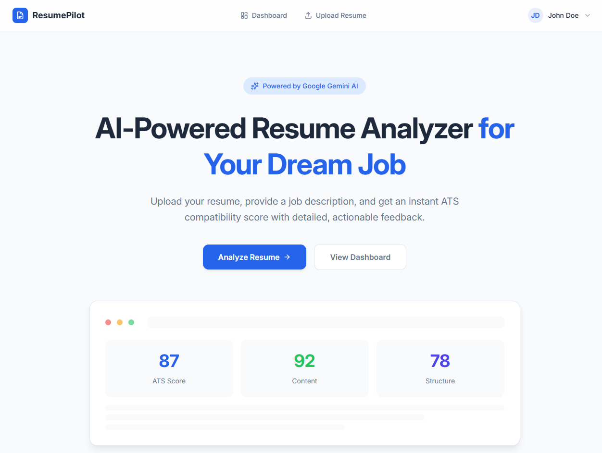
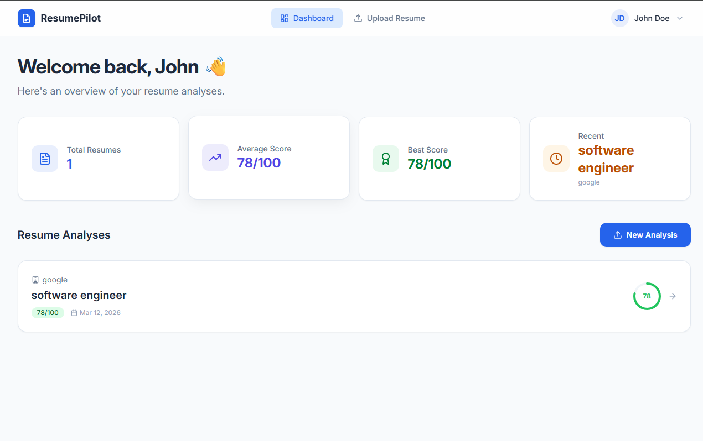
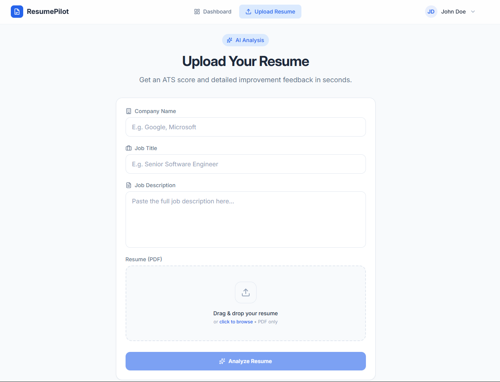

<div align="center">
  <br />
  <h1 align="center">ResumePilot</h1>
  <p align="center">
    <b>AI-powered ATS Resume Analyzer & Career Dashboard</b><br />
    Score your resume against job descriptions and get actionable feedback to land your dream job.
  </p>

  <div>
    
    
    
    
    
    
  </div>
</div>

---

## 📸 Project Showcase

<div align="center">
  <h3>✨ Modern Landing Page</h3>
  
</div>

<br />

<div align="center">
  <h3>🚀 Interactive Dashboard</h3>
  
</div>

<br />

<div align="center">
  <h3>📁 Smart Resume Upload</h3>
  
</div>

---

## 📋 Table of Contents

- [✨ Introduction](#-introduction)
- [⚙️ Tech Stack](#️-tech-stack)
- [🔋 Features](#-features)
- [📂 Project Structure](#-project-structure)
- [🚀 Getting Started](#-getting-started)
- [🔐 API Endpoints](#-api-endpoints)
- [📄 Environment Variables](#-environment-variables)

## ✨ Introduction

**ResumePilot** is a professional, full-stack AI resume analysis platform redesigned from the ground up for a premium SaaS experience. Built with a clean light theme inspired by Notion and Linear, it helps job seekers optimize their resumes through deep AI insights.

Key improvements in the latest version include:
- **Modern SaaS UI**: A complete overhaul using a professional light theme with glassmorphism effects.
- **Enhanced Animations**: Fluid page transitions and interactive elements powered by Framer Motion.
- **User Profile System**: Personal dashboards to manage skills, experience, and social links.
- **Deep Analysis**: Refined ATS scoring and category-specific feedback (Content, Structure, Tone, Skills).

## ⚙️ Tech Stack

### Frontend

| Technology | Purpose |
|---|---|
| [React Router v7](https://reactrouter.com/) | Modern framework for routing and full-stack capabilities |
| [TypeScript](https://www.typescriptlang.org/) | Type-safe development |
| [Tailwind CSS v4](https://tailwindcss.com/) | Next-generation styling engine |
| [Framer Motion](https://www.framer.com/motion/) | Industry-standard animation library |
| [Zustand](https://github.com/pmndrs/zustand) | Global state management |
| [Lucide React](https://lucide.dev/) | Premium vector iconography |

### Backend

| Technology | Purpose |
|---|---|
| [Node.js](https://nodejs.org/) | Scalable server runtime |
| [Express.js](https://expressjs.com/) | Robust REST API framework |
| [MongoDB Atlas](https://www.mongodb.com/atlas) | Cloud-hosted NoSQL database |
| [Google Gemini AI](https://ai.google.dev/) | `gemini-2.5-flash` for high-speed ATS analysis |
| [JWT](https://jwt.io/) | Secure authentication |

## 🔋 Highlights

- 🔐 **Secure Auth** — JWT-protected sessions with persistent authentication via Zustand.
- 👤 **Profile Management** — Specialized profile system to track career goals and skills.
- 🤖 **Gemini AI Engine** — Sophisticated parsing of PDF resumes against real-world ATS benchmarks.
- 📊 **Visual Feedback** — Animated score gauges and category-wise improvement roadmaps.
- 📄 **PDF Handling** — Native server-side PDF processing with secure client-side rendering.

## 📂 Project Structure

```
ResumePilot/
├── app/                          # Frontend (React Router v7)
│   ├── components/               # UI components (ATS, Accordion, ScoreGauge, etc.)
│   ├── layouts/                  # Reusable layouts (Main, Auth)
│   ├── lib/                      # API client, Zustand store, utilities
│   ├── routes/                   # Page routes (Dashboard, Upload, Profile, etc.)
│   └── app.css                   # Modern design system & Tailwind 4 tokens
├── backend/                      # Backend (Express.js)
│   ├── controllers/              # Business logic for auth and resumes
│   ├── models/                   # Mongoose schemas (User, Resume)
│   ├── services/                 # Gemini AI integration
│   └── routes/                   # API endpoint definitions
├── constants/                    # Shared AI prompts & constants
└── types/                        # Global TypeScript definitions
```

## 🚀 Getting Started

### Prerequisites

- Node.js (v18+)
- MongoDB Atlas Account
- Google Gemini API Key

### Installation

1. **Clone & Install**
   ```bash
   git clone https://github.com/AbhayMahalle/ResumePilot.git
   cd ResumePilot
   npm install
   ```

2. **Backend Setup**
   - Navigate to `/backend`
   - Create `.env`:
     ```env
     MONGO_URI=your_mongodb_uri
     JWT_SECRET=your_secret_key
     GEMINI_API_KEY=your_api_key
     PORT=5000
     ```

3. **Run Development**
   - Frontend: `npm run dev` (Port 5173)
   - Backend: `cd backend && npm start` (Port 5000)

## 🔐 API Endpoints

| Method | Endpoint | Description |
|---|---|---|
| `POST` | `/api/auth/register` | User signup |
| `POST` | `/api/auth/login` | User login |
| `PUT` | `/api/auth/profile` | Update user career data |
| `POST` | `/api/resumes/upload` | Analyze & upload resume |
| `GET` | `/api/resumes` | Fetch user analysis history |

---

<div align="center">
  <p>Built with ❤️ by <a href="https://github.com/AbhayMahalle">Abhay Mahalle</a></p>
</div>
