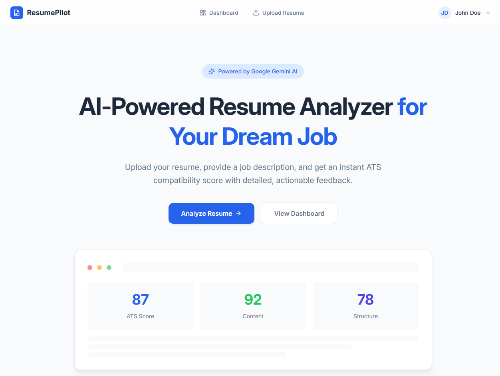
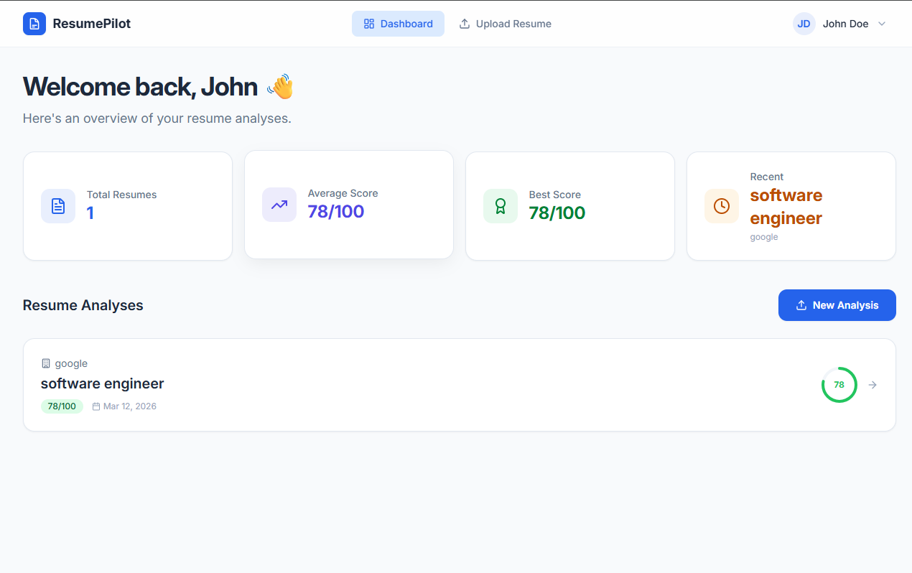
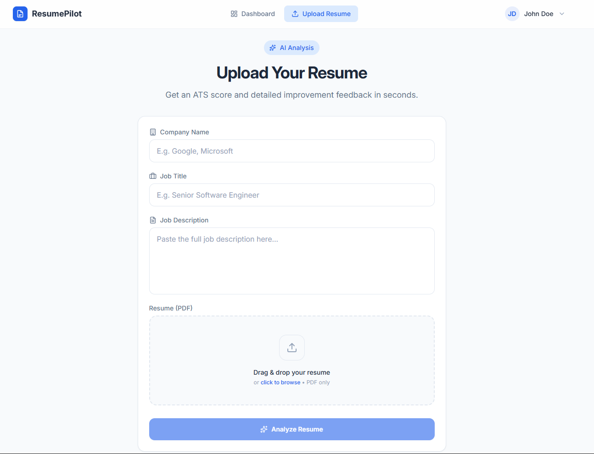

<div align="center">
  <br />
  <h1 align="center">ResumePilot</h1>
  <p align="center">
    <b>Enterprise-Grade AI Resume Analysis SaaS Platform</b><br />
    Leverage generative AI to score, analyze, and optimize resumes against real-world ATS benchmarks.
  </p>

  <div>
    
    
    
    
    
    
    
  </div>
</div>

---

## 🚀 Overview

**ResumePilot** is a production-ready, full-stack B2C/B2B SaaS application designed to help job seekers bypass automated ATS (Applicant Tracking Systems). It offers intelligent, dynamic parsing of resumes using Google's Gemini Pro AI, offering immediate score analysis and improvement roadmaps. 

Built with scalability, clean architecture, and rapid deployment in mind, ResumePilot represents the modern standard for AI-integrated web products.

---

## 📸 Product Showcase

<div align="center">
  <h3>✨ Conversion-Optimized Landing Page</h3>
  
</div>

<br />

<div align="center">
  <h3>📊 SaaS Dashboard & AI Analysis</h3>
  
</div>

<br />

<div align="center">
  <h3>📂 Drag-and-Drop Resume Processor</h3>
  
</div>

---

## 🏗 System Architecture

The project is structured with strict separation of concerns, ideal for serverless cloud deployments (like Vercel) while keeping developer velocity high.

- **Client:** React Router v7 application (Pure JavaScript/JSX) providing SSR/SSG and a highly interactive, animated client-side UI (Framer Motion, Tailwind CSS v4).
- **API/Backend:** Express.js REST API providing secure JWT authentication and managing server-side operations.
- **AI Engine:** Integration natively with the `gemini-2.5-flash` model for high-throughput, low-latency resume intelligence.
- **Database:** MongoDB Atlas handling structured user schemas, analytics data, and historical resume histories.

```text
ResumePilot/
├── app/                          # React Router v7 Frontend Application
│   ├── components/               # Granular SaaS UI elements (Gauges, Cards)
│   ├── layouts/                  # Auth and Main application shells
│   ├── lib/                      # Centralized Zustand store, API clients 
│   ├── routes/                   # File-system-based Next.js-style routing
│   └── app.css                   # Tailwind v4 utility setup
├── backend/                      # Node.js / Express API Server
│   ├── controllers/              # RESTful API logic handlers
│   ├── middleware/               # Auth & PDF validation guards
│   ├── models/                   # Mongoose DB Schemas
│   ├── routes/                   # Encapsulated API routes
│   └── services/                 # AI Engine connections (Gemini)
├── api/                          # Vercel Serverless Function entry point
└── vercel.json                   # Cloud deployment routing instructions
```

---

## 🔋 Core SaaS Features

- 🔐 **Persistent Authentication:** JWT-protected routes with secure cookie/local-storage management via Zustand.
- 🤖 **Proprietary AI Scoring:** Evaluates content against industry ATS benchmarks (Structure, Content, Tone, Buzzwords).
- 📈 **Data Visualization:** Animated custom SVG score gauges and segmented improvement charts.
- 📄 **Secure PDF Pipeline:** Server-side PDF extraction ensuring sensitive PII is never handled on untrusted environments.
- ⚡ **Edge-Ready Performance:** Compiled and minified deployment with zero-config Vercel optimization out of the box.

---

## 🛠 Deployment & Setup instructions

ResumePilot is pre-configured for a zero-friction deployment to Vercel, treating the Express backend as a serverless function.

### Local Development

1. **Clone the repository:**
   ```bash
   git clone https://github.com/AbhayMahalle/ResumePilot.git
   cd ResumePilot
   npm install
   ```

2. **Environment Variables:**
   Create a `.env` file in the `backend/` directory (or for your deployment provider):
   ```env
   # Database Configuration
   MONGO_URI=mongodb+srv://<user>:<password>@cluster0.exmpl.mongodb.net/resumepilot
   
   # Security
   JWT_SECRET=your_super_secret_jwt_key_here
   
   # Google AI Engine
   GEMINI_API_KEY=your_gemini_api_key_from_google_aistudio
   
   # Server Port
   PORT=5000
   ```

3. **Run the stack locally:**
   Start the frontend (port 5173):
   ```bash
   npm run dev
   ```
   Start the API Engine inside the `backend/` folder (port 5000):
   ```bash
   cd backend
   npm start
   ```

### ☁️ Production Deployment (Vercel)

The codebase includes `vercel.json` meaning deployment takes seconds:

1. Import your repository to Vercel.
2. Ensure Vercel framework preset is **Vite (React Router)**.
3. Add the aforementioned Environment Variables in the Vercel Dashboard.
4. Click **Deploy**. Vercel will automatically route `/api/*` to your Express.js backend and serve the react frontend accordingly!

---

## 🔐 API Reference

The backend provides a scalable JSON REST API for future client integrations (e.g. mobile apps).

| Resource | Method | Endpoint | Description |
|---|---|---|---|
| **Authentication** | `POST` | `/api/auth/register` | Create a new user account |
| **Authentication** | `POST` | `/api/auth/login` | Yields a secure JWT token |
| **Profiles** | `PUT` | `/api/auth/profile` | Update targeted job roles and tracking |
| **Analysis** | `POST` | `/api/resumes/upload` | Extracts PDF texts and streams AI scores |
| **History** | `GET` | `/api/resumes` | Retrieve historical analysis iterations |

---

<div align="center">
  <p>Engineered and carefully crafted by <a href="https://github.com/AbhayMahalle">Abhay Mahalle</a> for scalable SaaS deployment.</p>
</div>
